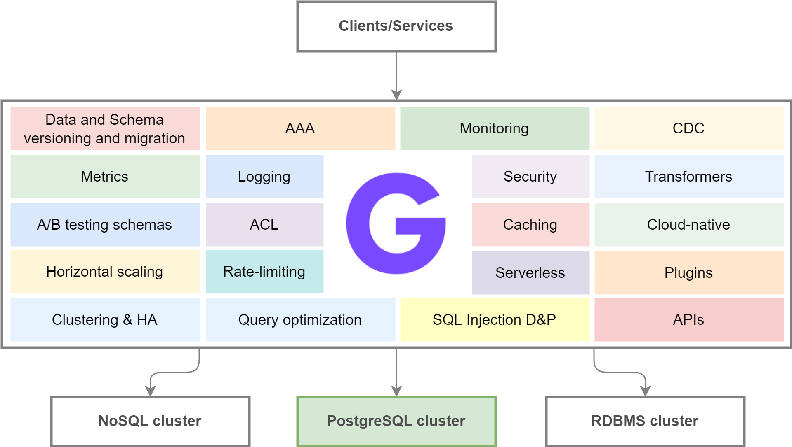

#  GatewayD

GatewayD is a cloud-native database gateway and framework for building data-driven applications. It sits in between your database(s) and your database client(s) and proxies all queries to and their responses from the database. While doing so, it supports the following features:

- Manage authentication, authorization and access
- Support multiple database backends (SQL and NoSQL)
- Manage queries, connections and clusters
- Secure and encrypt everything AMAP with different security protocols
- Observe, monitor, analyze and control traffic
- Transform queries, results, schemas and data
- Inject data into queries and results
- Deploy anywhere: on-premise, SaaS, Cloud, CI/CD and Serverless
- Cache queries and their results
- And a bunch of other things

## Architecture

The architecture of the GatewayD consists of a core part and the plugins. The core includes network and connection management components. Any other functionality in the system are served by plugins. Then there are core plugins, always shipped with each binary and community-supported plugins.

The ultimate goal is to be able to replace everything, even the core parts, with plugins. The plugin system uses the [Go plugin system over RPC](https://github.com/hashicorp/go-plugin) by HashiCorp. Thus, the core and the plugins talk over RPC and they can also be run over the network using gRPC or netRPC.

The high-level component architecture diagram is depicted below:



## Run GatewayD for development

You can build and run gatewayd by running the following commands. You must have Go and git installed.

```bash
git clone git@github.com:gatewayd-io/gatewayd.git && cd gatewayd
go mod tidy && go run main.go
INFO[0000] GatewayD is running with PID 31403
INFO[0000] There are 10 clients in the pool
INFO[0000] GatewayD is listening on 0.0.0.0:15432
```

## Run tests

The server will start listening on the default 15432 port and will proxy any clients that connects to its port to a PostgreSQL server running on port 5432. While the server is running, run the following commands to test the proxy feature(s). You must have Docker and `psql` installed.

```bash
# This run a PostgreSQL server as a Docker container
docker run --rm --name postgres-test -e POSTGRES_PASSWORD=postgres -p 5432:5432 -d postgres
# This will try to connect to the PostgreSQL server via gatewayd
psql -U postgres -p 15432 -h localhost
```

After entering the password, `postgres`, you can see the messages being passed between the PostgreSQL and the `psql` client in the terminal the gatewayd is running in. The `psql` command will work normally.

Another way to test it is to install the `psycopg` package and run the `client_test.py` script. It'll connect to a PostgreSQL server via GatewayD with SSL disabled, and then creates a table, insert one row and then selects and prints it.

```bash
pip install "psycopg[binary]"
python client_test.py
```

You can remove the Docker container by stopping it:

```bash
docker stop postgres-test
```

<!--
## Support

The support section.

## Contributing

The contributing section.
-->
